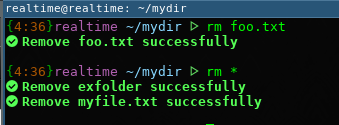
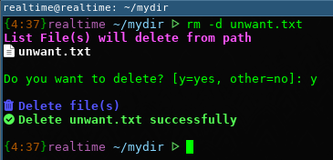
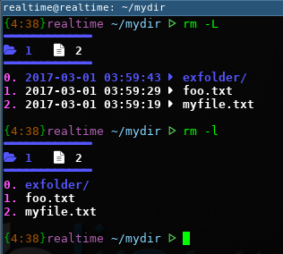
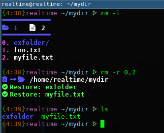
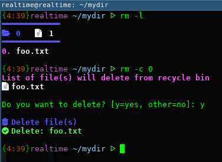

##Recycle Bin for Linux (Terminal Mode) such as i3wm##
##Update Log##

| Version | Update Detail                                                                         |
| :------:|:--------------------------------------------------------------------------------------|
|   2.3   | - Fixed color bug when delete failed (rm -c)                                          |
|   2.2   | - Add Details to Help (-h)                                                            |
|   2.1   | - Change config file from "~/.local/rbin/.rbinrc" to "~/.local/rbin/config            | 
|   2.0   | - No Init require when first start                                                    | 
|         |  - Change config file from /var/.rbinrc to ~/.local/rbin/.rbinrc                      | 
|         | - Remove "init" argument                                                              | 
|   1.2   | - Use ```rm -u or rm -user``` to show current user's bin                              |
|   1.1   | - Show Detail when disable/enable font awesome by run ```sudo rm -f {value}```        | 


##Installation
* move ```rbin.sh``` to ```/usr/bin```
* run command ``` sudo chmod 777 /usr/bin/rbin.sh ```
* re-open terminal

##Recommended
* Download and Install [FontAwesome](https://github.com/FortAwesome/Font-Awesome) for Icon
* if you want to replace ```rm``` with this, you can by follow this step
  - add ```alias sudo="sudo "``` to your .bashrc or your shell init
  - add ```alias rm="rbin.sh"``` to your .bashrc or your shell init
  - re-open terminal and Enjoy!
  - now you can call this script by use ```rm``` command

##Usage 
If you add ```alias rm="rbin.sh"``` to your .bashrc you can use ```rm``` instend of ```rbin.sh```. If not, you must use ```rbin.sh``` instend

* ~~First Step you need to init your user (temporary bin will be ```/home/{user}/.local/.rbin/```).~~ No init require since version 2.0 or later

* Remove file to Bin
  - pattern: ```rm {file1} {file2} {file3}```
  - ex1. ```rm file1.txt file2.txt``` remove by select manual
  - ex2. ```rm * .*``` remove all file and directory (include hidden file)
  - 

* Delete file from hardisk
  - pattern: ```rm -d {file1} {file2} {file3}```
  - ex1. ```rm -d file1.txt file2.txt``` delete by select manual
  - ex2. ```rm -d * .*``` delete all file and directory (include hidden file)
  - 
  
* List file in recycle bin
  - pattern: ```rm -l``` list short of file
  - pattern: ```rm -L``` list file with time
  - 
  
* Restore file from recycle bin
  - you can see index by ```rm -l```
  - pattern: ```rm -r {Index} {TargetPath}```
  - ex1. ```rm -r 0,1,2 ~/foo``` restore files to ```~/foo```
  - ex2. ```rm -r . ~/foo``` restore all files to ```~/foo```
  - ex3. ```rm -r 0,1``` restore files to current directory
  - 
  
* Clean Bin (Delete file from bin)
  - pattern: ```rm -c {Index}```
  - ex1. ```rm -c 0,1,2``` delete manual files from bin
  - ex2. ```rm -c``` delete all files from bin
  - 

* Get bin size
  - pattern: ```rm -s```
  
* Enable / Disable FontAwesome (Terminal must support Unicode)
  - pattern: ```sudo rm -f {value 0 or 1}```
  - ex1. ```sudo rm -f 0``` disable FontAwesome
  - ex2. ```sudo rm -f 1``` enable FontAwesome

* Show current user's bin
  - pattern: ```rm -u```
  
##Manual Config
*Config file will be ~/.config/rbin/.rbinrc*

* Enable Font awesome (Terminal need support Unicode)
  - ```ENABLE_FONT=1``` to render with font awesome icon
  - ```ENABLE_FONT=0``` to disable font awesome icon
